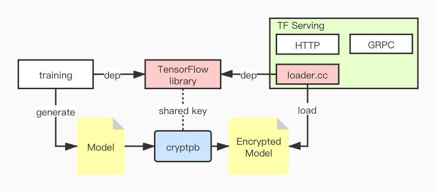

# TensorFlow Serving

[README](README.md) | [中文文档](README_zh.md)

## Difference from origin repo

This forked repo provide a way to protect the safety of model files, it uses forked TensorFlow repo [https://github.com/Laiye-Tech/tensorflow](https://github.com/Laiye-Tech/tensorflow) which modified `ReadBinaryProto` function for loading an encrypted saved model(a pb file). So the saved model should be ecnrypted by our [ecnrypt tool](https://github.com/Laiye-Tech/cryptpb).

## Architecture of encrypted model



Our encryption tool and `TensorFlow`'s decryption module (`loader.cc`) share the secret key which is hard-coded in the code. After the model training is completed, the encryption tool is used to encrypt the model into a ciphertext model. `TF-serving` requires the model that reads the ciphertext be decrypted before using it.

### Build from sources

Same as the official build method. 

**CPU**
```sh
docker build --build-arg \
    -t tensorflow-serving-devel \
    -f tensorflow_serving/tools/docker/Dockerfile.devel .

docker build --build-arg \
    TF_SERVING_BUILD_IMAGE=tensorflow-serving-devel \
    -t tensorflow-serving \
    -f tensorflow_serving/tools/docker/Dockerfile .
```

**GPU**
```sh
docker build -t tensorflow-serving-devel-gpu \
    -f tensorflow_serving/tools/docker/Dockerfile.devel-gpu .

docker build --build-arg \
    TF_SERVING_BUILD_IMAGE=tensorflow-serving-devel-gpu \
    -t tensorflow-serving-gpu \
    -f tensorflow_serving/tools/docker/Dockerfile.gpu .
```

### Run

Make sure saved_model.pb is encrypted by our [crypt tool](https://github.com/Laiye-Tech/cryptpb#run)

```sh
# Location of demo models
export MODEL_DIR=$PWD/tensorflow_serving/servables/tensorflow/testdata/saved_model_half_plus_two_cpu/
export MODEL_NAME=half_plus_two

# Start TensorFlow Serving container and open the REST API port
docker run -t --rm -p 8501:8501 -p 8500:8500 \
    -v "$MODEL_DIR:/models/$MODEL_NAME" \
    -e MODEL_NAME=$MODEL_NAME \
    tensorflow-serving &

# Query the model using the predict API
curl -d '{"instances": [1.0, 2.0, 5.0]}' \
    -X POST http://localhost:8501/v1/models/half_plus_two:predict

# Returns => { "predictions": [2.5, 3.0, 4.5] }
```
